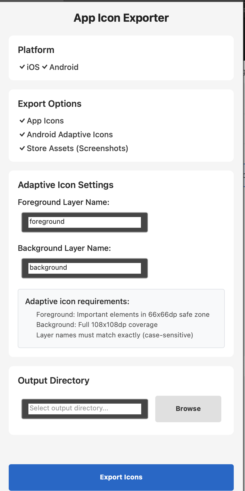

# App Icon Exporter for Photoshop

iOS・Android向けアプリアイコンをPSDファイルから各サイズに一括エクスポートするPhotoshopプラグイン



## 特徴

- iOS向けアプリアイコンの全サイズ出力（18種類）
- Android向けアプリアイコンの全サイズ出力（12種類）
- 2024年最新のアプリストア要件に対応
- Android アダプティブアイコン完全対応（前景・背景分離）
- 直感的なUI操作
- プログレス表示とエラーハンドリング

## インストール

### 前提条件
- Adobe Photoshop 2022以降 (v26.0.0+)
- UXP Developer Tool
- macOS または Windows

### 手順

1. **このリポジトリをクローン**
   ```bash
   git clone [repository-url]
   cd AppIconExporter
   ```

2. **UXP Developer Toolをインストール**
   - Adobe Creative Cloud Desktop → UXP Developer Tool

3. **Photoshopで開発者モードを有効化**
   - Photoshop → 環境設定 → プラグイン → 「開発者モードを有効にする」
   - Photoshopを再起動

4. **プラグインを読み込み**
   - UXP Developer Tool → 「Add Plugin...」
   - `manifest.json` ファイルを選択 → 「Load」

## 使用方法

1. Photoshopでアプリアイコン用PSDファイルを開く
2. プラグイン → App Icon Exporter を選択
3. プラットフォーム（iOS/Android）を選択
4. 出力フォルダを指定
5. 「Export Icons」をクリック

## 出力されるアイコンサイズ

### iOS (18種類)
- App Store: 1024x1024
- iPhone: 180x180, 120x120, 87x87, 58x58, 60x60, 40x40
- iPad: 167x167, 152x152, 76x76, 80x80, 40x40, 58x58, 29x29, 40x40, 20x20

### Android (12種類 + アダプティブアイコン)
- Play Store: 512x512
- レガシーアイコン: 432x432〜36x36 (11種類)
- **アダプティブアイコン**: 前景・背景各5サイズ (432x432〜108x108)

## トラブルシューティング

- **ロードできない** → 開発者モードが有効か確認
- **権限エラー** → ファイルアクセスを許可
- **エクスポートできない** → PSDファイルが開いているか確認

詳細は [docs/](docs/) フォルダのガイドを参照してください。

## ライセンス

MIT License - Copyright (c) 2025 Famulite Lab. LLC

詳細は [LICENSE](LICENSE) ファイルをご覧ください。